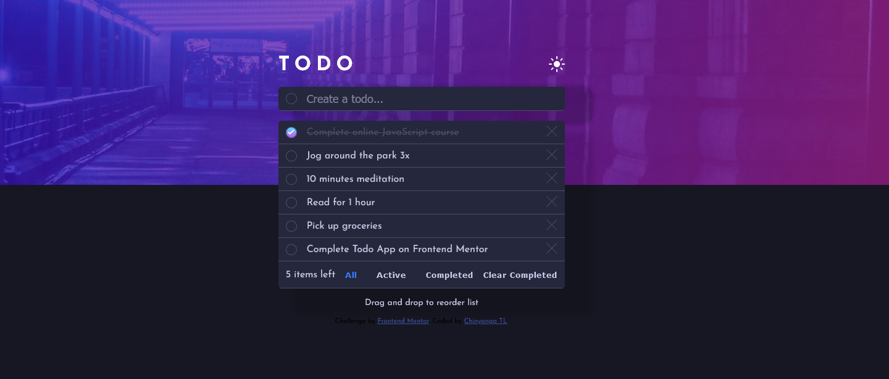

# Frontend Mentor - Todo app solution

Lord knows it's not perfect.

This is a solution to the [Todo app challenge on Frontend Mentor](https://www.frontendmentor.io/challenges/todo-app-Su1_KokOW). Frontend Mentor challenges help you improve your coding skills by building realistic projects. 

## Table of contents

- [Overview](#overview)
  - [The challenge](#the-challenge)
  - [Screenshot](#screenshot)
  - [Links](#links)
- [My process](#my-process)
  - [Built with](#built-with)
  - [What I learned](#what-i-learned)
  - [Continued development](#continued-development)
  - [Useful resources](#useful-resources)
- [Author](#author)

**Note: Delete this note and update the table of contents based on what sections you keep.**

## Overview

### The challenge

Users should be able to:

- View the optimal layout for the app depending on their device's screen size
- See hover states for all interactive elements on the page
- Add new todos to the list
- Mark todos as complete
- Delete todos from the list
- Filter by all/active/complete todos
- Clear all completed todos
- Toggle light and dark mode
- **Bonus**: Drag and drop to reorder items on the list

### Screenshot

### Links

- Solution URL: [Add solution URL here](https://your-solution-url.com)
- Live Site URL: [Add live site URL here](https://your-live-site-url.com)

## My process

### Built with

- Semantic HTML5 markup
- CSS custom properties
- Flexbox
- [React](https://reactjs.org/) - JS library

### What I learned

Really taking advantage of the Context API and Reducers. A big stepping stone for my journey into Redux.

### Continued development

Maybe make it mobile responsive and style it better. Lord knows I can do better. Also, I'm sure there is a bug with the toggle functionality and I know what is causing it, but I just cannot solve it right now.

### Useful resources

- [React Beautiful Dnd](https://www.npmjs.com/package/react-beautiful-dnd) - This helped me with the drag and drop functionality. The documentation is really good and easy to follow.
- [React Toastify](https://fkhadra.github.io/react-toastify/introduction/) - Brilliant customizable toast library, loved it, will definately use again.
- [John Smilga](https://www.youtube.com/watch?v=iZhV0bILFb0&list=PLnHJACx3NwAe-GJ4GfptzUs8g7lFhE9DV&index=1) - He taught me most of what I know about React. The major thing here was the Context API

## Author

- Website - [Github](https://github.com/ChinyangaTL)
- Frontend Mentor - [@beyonce-beytwice](https://www.frontendmentor.io/profile/beyonce-beytwice)

**Note: Delete this note and add/remove/edit lines above based on what links you'd like to share.**

